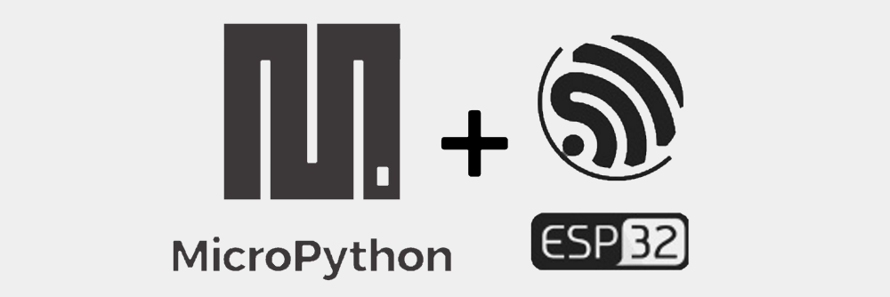

# micropython-esp32

This notebook introduces MicroPython running on ESP32 based microcontrollers. 

Jupyter Notebook running the MicroPython Remote kernel is used to interact with an ESP32 microcontroller over its REPL interface. An overview of the ESP32 hardware and associated MicroPython libraries is presented. 

MicroPython sample code presented include:
- Control of a LED from GPIO pins.
 - Hardware timers.
 - Pulse Width Modulation (PWM).
 - Triggering a LED from a hardware interrupt.
 - Capacitive touch
- I2C bus scan
 - BME280 sensor control.
 - Inertial Measurement Unit
- Introduction to ESP32 Wifi.
 - Set RTC from NTP server
 - HTTP requests
- Concurrent programming model using AsyncIO
- ESP32 deepsleep.
- Upload scripts to the microcontroller.
- Sigrok PulseView and logic analyzers.

